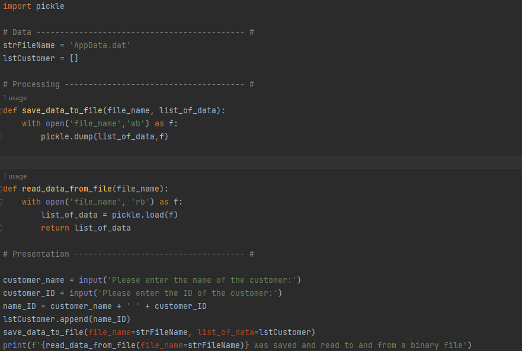
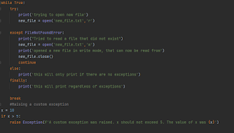
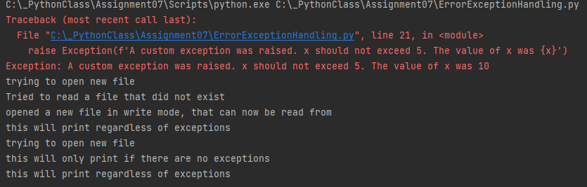

# Pickling and Error Exception Handling
*Wyatt Parks 31May2023*

 In Python, there are two essential concepts that every programmer should understand: pickling and error exception handling. Pickling provides a convenient way to serialize and store objects, allowing for easy preservation and reconstruction of complex data structures. On the other hand, error exception handling equips developers with the ability to anticipate and handle errors, ensuring smooth execution of their code even in the face of unexpected events. Together, these topics form the foundation of Python programming, enabling efficient data management and robust error management, ultimately contributing to the reliability and effectiveness of Python applications.

Pickle is a module that can be imported to allow objects to be serialized and stored in a binary format. It can convert simple objects such as strings and integers. It can also convert more complex objects such as lists and dictionaries. The 'dump()' function allows for the conversion, and it accepts parameters for the object and the file. The 'load()' function converts data from a file back into readable data and accepts the file as a parameter.

Error exception handling is a method to catch and handle errors that occur while the code is running. Exception handling is done using try and except blocks, where the code is placed within the try block and any errors are passed to the exception block. There can be multiple exception blocks for a try block to catch multiple errors. Additionally, custom exceptions can be raised that wouldn't normally cause an error.

The script begins with importing the pickle module. Then functions are defined to write to binary data to a file and read binary data from file. The write function used the .dump() function with the parameters, the file name and the list of data to be added. The file name was passed to the .dump() function using a with function so the file would close after the action is performed. In the ‘with’ function, the command to open the file in the write binary mode was set as ‘f’, which was passed to the .dump() function. The read data function used the ‘with’ function in the same capacity but the file was opened in the read binary mode instead. Using .load() function the contents of the file were set to the variable ‘list_of_data’ which was returned out of the function.

In the presentation section of the code the user was prompted to enter in a customer name and ID. Those variables were concatenated and appended to a list which was passed into the save data function. Finally, the read data function was printed which returned the unpickled contents of the file.

In the error exception example script the script begins with trying to open a file in read mode that does not exist. An exception is raised that informs the user of what occurred and corrects the error by opening the file in the write mode, which will create a new file if there is none and continues to the start of the while loop. The script continues with an else statement which will only print once the original error was correct. The finally statement will print both times. The next is an example of a custom exception that is raised for x being greater than 10, which is not normally an error.

 In conclusion, pickling and error exception handling are vital concepts in Python programming. Pickling allows for the serialization and storage of objects, facilitating easy preservation and reconstruction of complex data structures. Error exception handling, on the other hand, empowers developers to anticipate and manage errors, ensuring the smooth execution of their code even in the face of unexpected events. These concepts play crucial roles in promoting efficient data management and robust error management, contributing to the reliability and effectiveness of Python applications. By understanding and effectively utilizing pickling and error exception handling, programmers can create more resilient and efficient software solutions.

